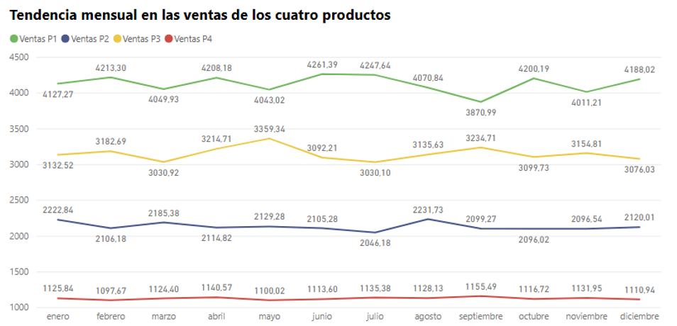
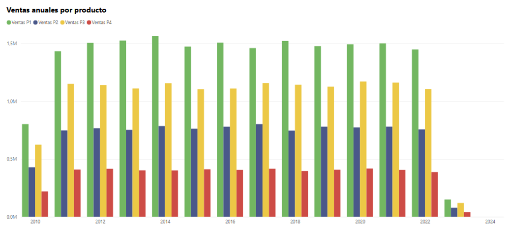
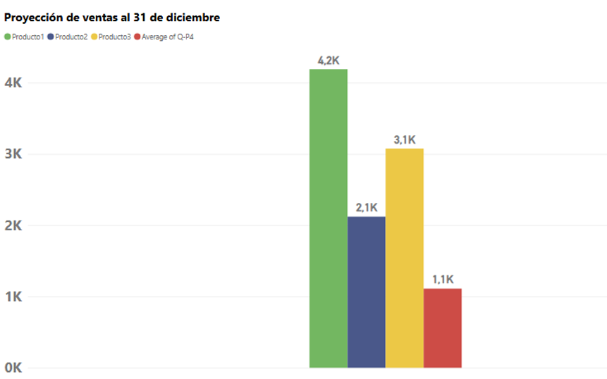
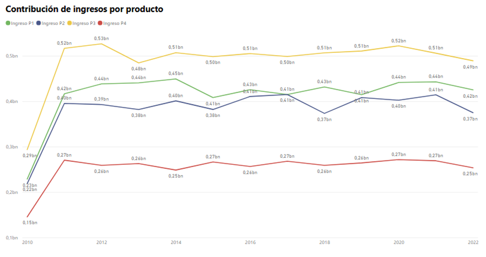
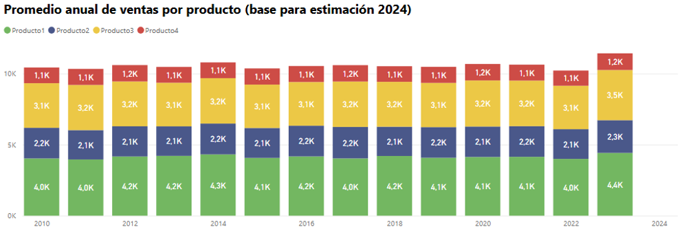
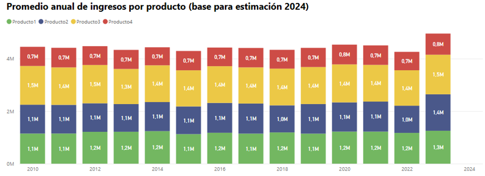

# 📊 Análisis de Ventas de Productos - Proyecto Power BI

<div align="center">
  
  
  
  
  
</div>

## 🎯 Descripción del Proyecto

Este repositorio presenta un **dashboard completo de análisis de ventas** construido con Power BI, utilizando un conjunto de datos sintéticos generados con Python con fines educativos. El dataset contiene datos hipotéticos de ventas sin ningún parecido con empresas reales.

> **Nota:** Este es un proyecto de aprendizaje basado en datos de práctica disponibles públicamente. Cualquier similitud con negocios reales es pura coincidencia.

---

## 🔍 Preguntas de Negocio Analizadas

### 1️⃣ Análisis de Tendencias de Ventas
**Pregunta:** *¿Hay alguna tendencia en las ventas de los cuatro productos durante ciertos meses?*



**📈 Insights Clave:**
- No se observa una tendencia clara de crecimiento o disminución a lo largo del año
- Las variaciones mensuales moderadas sugieren **comportamiento estacional** más que tendencias definidas
- Los patrones de ventas indican fluctuaciones cíclicas en la demanda

---

### 2️⃣ Producto con Mejor Desempeño
**Pregunta:** *De los cuatro productos, ¿cuál ha tenido las mayores ventas en todos los años dados?*



**🏆 Insights Clave:**
- El **Producto 1** domina con las mayores ventas en todos los años analizados
- El año 2023 muestra valores más bajos debido a que es un período incompleto
- Líder claro en generación de ingresos

---

### 3️⃣ Proyección de Ventas de Fin de Año
**Pregunta:** *La empresa cierra todos sus centros minoristas el 31 de diciembre de cada año. El CEO, Sr. Hariharan, desea obtener una estimación del número de unidades de cada producto que podrían venderse el 31 de diciembre si todos los centros permanecieran abiertos.*



**💡 Unidades Proyectadas para el 31 de Diciembre:**
| Producto | Unidades Estimadas |
|----------|-------------------|
| Producto 1 | 4,200 unidades |
| Producto 2 | 2,100 unidades |
| Producto 3 | 3,100 unidades |
| Producto 4 | 1,100 unidades |

---

### 4️⃣ Análisis de Discontinuación de Productos
**Pregunta:** *El CEO está considerando la idea de abandonar la producción de cualquiera de los productos. Analice estos datos y sugiera si su idea resultaría en un revés masivo para la empresa.*



**⚠️ Recomendación Estratégica:**
- **NO discontinuar ningún producto**
- Todos los productos muestran trayectorias estables y saludables
- Ningún producto está perdiendo cuota de mercado
- Es aconsejable mantener el portafolio completo de productos

---

### 5️⃣ Pronóstico de Ingresos 2024
**Pregunta:** *El CEO también quiere predecir las ventas e ingresos para el año 2024. Proporcione una estimación anual con la mayor precisión posible.*




**🎯 Proyecciones 2024 (Basado en Promedios Históricos):**
```
📦 Unidades Totales:  ~10,600 unidades
💰 Ingresos Totales:  ~$4.4M USD
```

---

## 🛠️ Tecnologías Utilizadas

- **Power BI Desktop** - Visualización de datos y creación de dashboards
- **DAX** - Modelado de datos y cálculos
- **Python** - Generación del dataset (fuente original)
- **Excel/CSV** - Almacenamiento y manipulación de datos

---

## 📂 Estructura del Proyecto

```
├── assets/
│   ├── Análisis1.png
│   ├── Análisis2.png
│   ├── Análisis3.png
│   ├── Análisis4.png
│   ├── Análisis5.png
│   └── Análisis5.1.png
├── data/
│   └── sales_data.csv
└── README.md
```

---

## 🚀 Conclusiones Clave

✅ El portafolio de productos está saludable con rendimiento estable  
✅ Se identificaron patrones estacionales para mejor planificación de inventario  
✅ El pronóstico basado en datos permite toma de decisiones estratégicas  
✅ El análisis de operaciones de fin de año revela potencial de ingresos sin explotar  

---

## 📫 Conéctate Conmigo

<div align="center">
  
[](tu-url-linkedin)
[](tu-url-github)
[](tu-url-portfolio)

</div>

---

<div align="center">
  
**⭐ Si este proyecto te resultó útil, ¡considera darle una estrella!**

*Hecho con ❤️ y Power BI*

</div>
